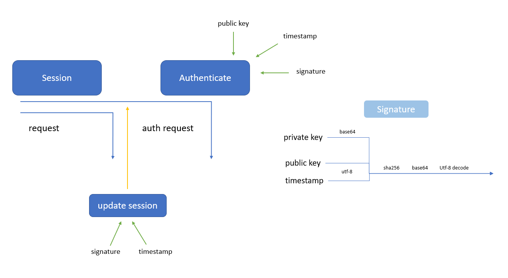

# 👨‍💻 RequestSample

Python request modülü ile güvenlikli (base64, sha256) API kullanımı

## 👨‍💻 Kaynak Kod

- 📂 Kaynak kodu [main.py](main.py) içerisindedir
- 💁‍♂️ Kullandığınız API yapısına göre şekillendirebilirsiniz

## 📋 Bahsi geçen konuların listesi:

-  🧐 Temel request konseptleri
- 👮‍♂️ Kimlik doğrulaması
- 🔒 Base64, SHA256 ile şifrelenmiş signature oluşturma
- 🐥 Session oluşturma
- 💎 Get request örneği

## 🔳 Şematik

## ✍ El Yazım

## 📺 Video Açıklaması

